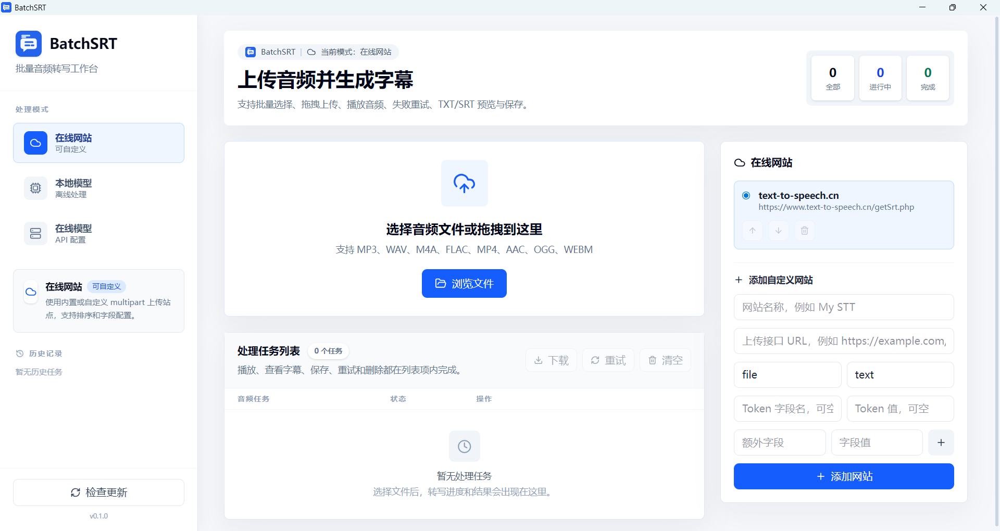
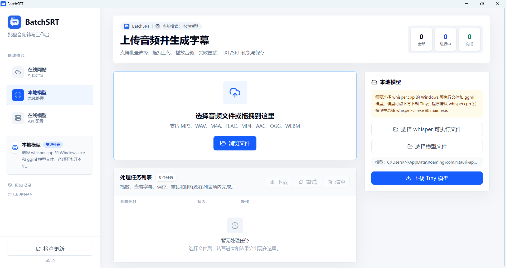
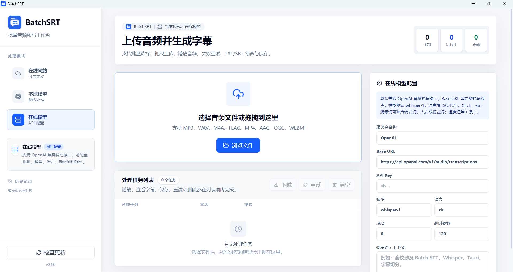

# BatchSRT



BatchBatchSRT 是一个基于 Tauri 2、React、TypeScript 和 Rust 的桌面端批量音频转字幕工具。它支持在线网站转写、在线模型 API 转写和本地 whisper.cpp 模型转写，并提供任务列表、音频播放、TXT/SRT 结果预览、批量下载、重试和历史记录等功能。

## 功能特性

- 批量选择或拖拽上传音频文件。
- 支持 MP3、WAV、M4A、FLAC、MP4、AAC、OGG、WEBM 等常见格式。
- 三种转写模式：
  - 在线网站：内置 `text-to-speech.cn`，也可添加自定义 multipart 上传站点。
  - 在线模型：支持 OpenAI 兼容音频转写接口，可配置 Base URL、API Key、模型、语言、提示词、温度和超时。
  - 本地模型：调用本机 whisper.cpp 可执行文件和 ggml 模型文件，音频不离开本地。
- 任务列表支持播放、停止、查看 TXT、查看 SRT、保存、重试、删除。
- 支持批量下载、批量重试和清空任务。
- SRT 弹窗按时间轴展示，TXT 弹窗按段落展示。
- 左侧固定导航和历史记录。
- Windows/macOS 桌面应用打包。

## 技术栈

- Frontend: React 19, TypeScript, Vite, Tailwind CSS, lucide-react
- Desktop: Tauri 2
- Backend: Rust, Tokio, Reqwest
- Tauri plugins:
  - `@tauri-apps/plugin-dialog`
  - `@tauri-apps/plugin-fs`
  - `@tauri-apps/plugin-opener`

## 目录结构

```text
.
+-- src/                  # React 前端
|   +-- App.tsx            # 主界面与任务逻辑
|   +-- App.css            # Tailwind 入口和全局样式
|   +-- main.tsx           # React 入口
+-- src-tauri/            # Tauri/Rust 后端
|   +-- src/
|   |   +-- lib.rs          # Tauri 命令注册
|   |   +-- local_model.rs  # 本地模型、音频读取、模型下载
|   |   +-- online_api.rs   # 在线模型 API 调用
|   |   +-- online_mock.rs  # 在线网站上传
|   +-- icons/             # 应用图标
|   +-- Cargo.toml
|   +-- tauri.conf.json
+-- public/
|   +-- batchsrt.svg       # 前端 favicon
+-- package.json
+-- README.md
```

## 环境要求

### 通用

- Node.js 18 或更高版本，建议使用当前 LTS。
- npm。
- Rust stable 工具链。
- Tauri 2 所需系统依赖。

安装 Rust：

```bash
curl --proto '=https' --tlsv1.2 -sSf https://sh.rustup.rs | sh
```

Windows 用户也可以从 <https://rustup.rs/> 下载安装。

### Windows 打包要求

- Windows 10/11。
- Microsoft Visual Studio Build Tools 或 Visual Studio，安装：
  - Desktop development with C++
  - MSVC v143 或当前版本
  - Windows 10/11 SDK
- Rust MSVC toolchain：

```powershell
rustup default stable-msvc
```

### macOS 打包要求

- macOS。
- Xcode Command Line Tools：

```bash
xcode-select --install
```

- Rust stable。

注意：Tauri 通常需要在目标平台上打包目标平台产物。也就是说，Windows 安装包在 Windows 上生成，macOS `.app/.dmg` 在 macOS 上生成。

## 安装依赖

```bash
npm install
```

如果是第一次构建 Rust 后端，Cargo 会自动下载 Rust 依赖。

## 开发运行

仅运行前端 Vite：

```bash
npm run dev
```

运行 Tauri 桌面应用：

```bash
npm run tauri dev
```

或：

```bash
npx tauri dev
```

Tauri 开发配置位于 `src-tauri/tauri.conf.json`，当前 `devUrl` 为：

```text
http://localhost:1420
```

## 构建前端

```bash
npm run build
```

该命令会执行：

```bash
tsc && vite build
```

输出目录：

```text
dist/
```

## 生成 Windows 可执行文件和安装包

请在 Windows 环境中执行。

1. 安装依赖：

```powershell
npm install
```

2. 确认 Rust MSVC 工具链：

```powershell
rustup default stable-msvc
rustup update
```

3. 打包：

```powershell
npm run tauri build
```

或：

```powershell
npx tauri build
```

4. 产物位置通常在：

```text
src-tauri\target\release\
src-tauri\target\release\bundle\
```

常见产物包括：

```text
src-tauri\target\release\tauri-app.exe
src-tauri\target\release\bundle\nsis\*.exe
src-tauri\target\release\bundle\msi\*.msi
```

实际安装包类型取决于本机环境和 Tauri bundler 配置。当前 `src-tauri/tauri.conf.json` 中 `bundle.targets` 为 `all`，Tauri 会尽量生成当前平台支持的全部包类型。

## 生成 macOS 可执行文件、.app 和 .dmg

请在 macOS 环境中执行。

1. 安装依赖：

```bash
npm install
```

2. 确认 Xcode Command Line Tools：

```bash
xcode-select --install
```

3. 更新 Rust：

```bash
rustup update
```

4. 打包：

```bash
npm run tauri build
```

或：

```bash
npx tauri build
```

5. 产物位置通常在：

```text
src-tauri/target/release/
src-tauri/target/release/bundle/
```

常见产物包括：

```text
src-tauri/target/release/tauri-app
src-tauri/target/release/bundle/macos/BatchSRT.app
src-tauri/target/release/bundle/dmg/*.dmg
```

如果需要分发给其他 macOS 用户，建议进一步配置 Apple Developer 签名和 notarization。未签名应用可能会被 Gatekeeper 拦截。

## 本地模型配置

本地模型模式依赖 whisper.cpp。

需要两个文件：

- whisper.cpp Windows/macOS 可执行文件，例如：
  - Windows: `whisper-cli.exe` 或 `main.exe`
  - macOS: `whisper-cli` 或 `main`
- ggml 模型文件，例如：
  - `ggml-tiny.bin`
  - `ggml-base.bin`
  - `ggml-small.bin`

应用内提供 Tiny 模型自动下载：

```text
https://huggingface.co/ggerganov/whisper.cpp/resolve/main/ggml-tiny.bin
```

本地模型执行时会调用类似命令：

```bash
whisper-cli -m ggml-tiny.bin -f input.mp3 -osrt -otxt
```

如果提示“本地模型程序不是有效的 Windows 可执行文件”，通常表示选择了错误文件，例如 `.bin` 模型文件、压缩包、快捷方式，或旧版本误下载生成的无效 `whisper.exe`。请重新选择真正的 whisper.cpp 可执行文件。

## 在线模型配置说明

在线模型模式默认按 OpenAI 兼容音频转写接口发送 multipart 请求。

字段说明：

- 服务商名称：仅用于界面和错误提示，例如 `OpenAI`。
- Base URL：完整转写接口地址，例如：

```text
https://api.openai.com/v1/audio/transcriptions
```

- API Key：服务商密钥。
- 模型：例如 `whisper-1`。
- 语言：ISO 语言代码，例如 `zh`、`en`。
- 温度：通常为 `0` 到 `1`。
- 超时秒数：默认 `120`。
- 提示词 / 上下文：可填写人名、专有名词、业务术语，帮助模型识别。

## 自定义在线网站

在线网站模式支持新增 multipart 上传站点。

字段说明：

- 网站名称：用于显示。
- 上传接口 URL：服务端接收上传的地址。
- 文件字段名：multipart 中音频文件字段名，例如 `file`、`video`。
- 结果字段路径：JSON 响应里字幕文本字段路径，例如 `text`、`data.text`。
- Token 字段名 / Token 值：可选，会作为普通 multipart 文本字段提交。
- 额外字段：可添加多个固定文本字段，例如 `type=stt`。

内置 `text-to-speech.cn` 配置示例：

```text
URL: https://www.text-to-speech.cn/getSrt.php
文件字段名: video
结果字段路径: text
额外字段: type=stt
Token 字段名: token
```

## 常用命令

```bash
# 安装依赖
npm install

# 前端开发
npm run dev

# 桌面开发
npm run tauri dev

# 前端构建
npm run build

# 桌面打包
npm run tauri build

# Rust 检查
cd src-tauri
cargo check

# Rust 格式化
cd src-tauri
cargo fmt
```

## 常见问题

### 1. npm run tauri dev 无法启动

确认 Node.js、npm、Rust 和 Tauri 系统依赖已安装。Windows 上尤其需要 Visual Studio Build Tools 和 Windows SDK。

### 2. 本地模型无法执行

确认选择的是 whisper.cpp 可执行文件，而不是模型文件。Windows 上必须选择 `.exe`，并且需要与当前系统架构兼容。

### 3. 音频播放失败

应用会通过 Tauri 后端读取本地音频并交给前端播放器播放。如果仍失败，通常是系统 WebView 不支持该音频编码。建议转换为 MP3、WAV、FLAC 或 WEBM 后重试。

### 4. macOS 打开应用提示无法验证开发者

未签名应用可能被 macOS Gatekeeper 拦截。开发测试时可在系统设置中允许打开；正式分发建议配置 Apple Developer 签名和 notarization。

## License

当前项目未声明许可证。如需开源或分发，请先补充 LICENSE 文件。
